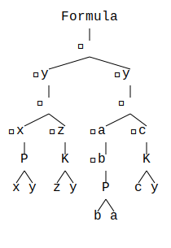

# Predicate logic visualizer

> [!WARNING]
> This application has not been tested for correctness. There might be unsuppored language constructs, mistakes against order of operations...

A small Rust app that visualizes the abstract syntax tree for a given predicate logic formula.

## Usage

> This project requires you to have Rust installed.

1. Clone: `git clone git@github.com:Yendric/predicate-logic-visualizer`
2. Either run using `cargo run` or build with `cargo build --release`
3. Fill in the formula you want to visualize
4. View the output in `out.svg`

## Example

Let's visualize the following formula: `(∃y : (∃x : P (x, y)) ⇒ (∀z : K(z, y))) ⇒ ∃y : (∀a : ∃b : P (b, a)) ⇒ ∀c : K(c, y)`

The application will output the following image:

## Contribute

Feel free to create an issue/PR if you have suggestions or find mistakes.
